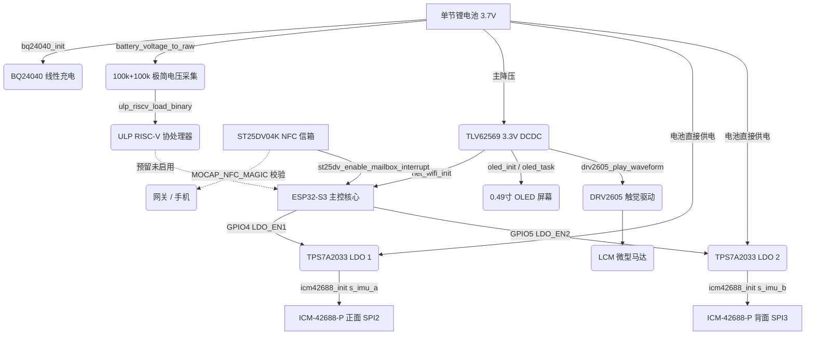
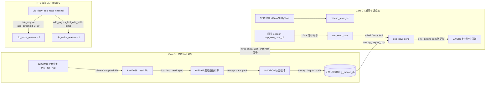
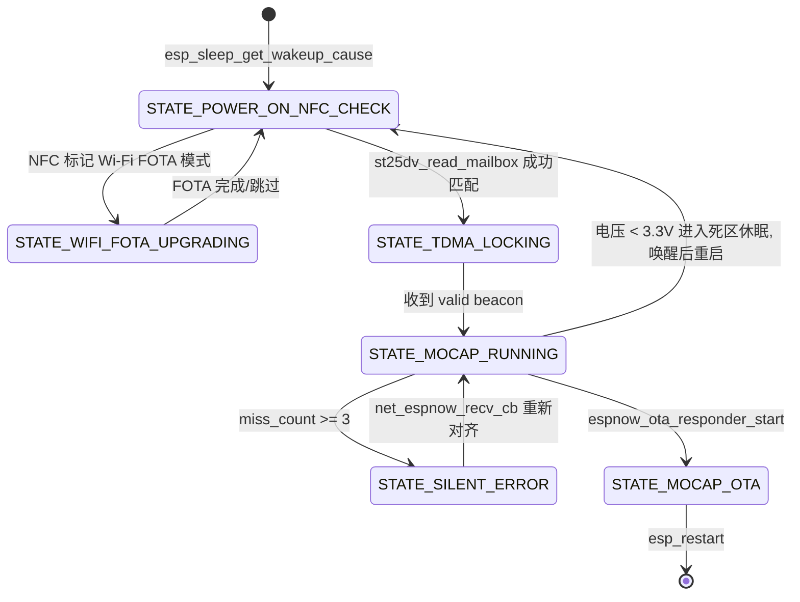

# SomatoSync 医疗级全身运动障碍追踪系统核心架构总览

本文档汇总了整个 SomatoSync 追踪节点（V3.0）的全局架构特征，涵盖从物理层硬件设计到顶层 ROS2 解算算法的五层技术栈，并附有系统拓扑、双核协同、生命周期状态转移的全局框架图。系统定位为面向脑卒中、帕金森、脑瘫、多发性硬化、骨关节术后、运动损伤等全身运动功能障碍的量化追踪与评估设备，最小 4 节点演示配置（骨盆 + 双大腿 + 胸椎）可弹性扩展至 12 节点全身动捕（头/颈/胸/骨盆/双上臂/双前臂/双大腿/双小腿）。

---

## 1. 核心五层技术栈

### 1.1 核心硬件架构 (Hardware Architecture)
* **主控与传感器**：采用 ESP32-S3-MINI-1U + 双面贴装 ICM-42688-P (U1/U2)。采用**“应力隔离半岛”布局**，物理抵消外壳形变导致的 IMU 零偏漂移。
* **电源管理**：TLV62569 主降压 + 独立双路 TPS7A2033 LDO（为两颗 IMU 独立进行二次稳压去噪）。
* **DFM 亮点**：
  * **NFC 物理隔离**：RB521S-30 二极管（D3）设为 DNP（空贴），切断能量回流路径，NFC 仅用于 GPO 中断唤醒系统。
  * **ADC 极简采样**：采用 100kΩ+100kΩ 常驻高阻分压网络，并联 100nF 电容，实现零引脚、零延时、极低漏电（21μA）的电池电压采集。
  * **电源门控**：使用 PMOS+NMOS 级联构建受控电源轨，切断 OLED 屏幕休眠时的反向漏电流。

### 1.2 无线组网与调度 (RF & TDMA Protocol)
* **底层协议**：基于底层的 **ESP-NOW** 协议（绕过 LwIP 协议栈，实现低功耗与低延迟）。
* **同步机制**：**帧头信标同步法 (Beacon-Sync TDMA)**。网关每 10ms 广播一次 Beacon（同步信标）进行全网时间同步。
* **时隙分配**：在 10ms 周期内划分多个时隙，为每个节点分配专属 700μs 的发射隔离带。
* **飞轮容错 (Flywheel Dead-Reckoning)**：允许连续丢弃 3 次 Beacon（30ms 盲区），节点依靠本地石英晶振定时器“盲发”维持运作；若超过 3 次未收到 Beacon，则触发“失步静默”机制，终止发送以防时钟偏移导致全局空口碰撞。

### 1.3 数据链路与压缩 (Data Link & Compression)
* **采样策略**：节点内部以 1000Hz 运行 ESKF 滤波解算，积攒后以 100Hz 发射打包上报（每包满载 10 帧数据）。
* **数据压缩**：
  * **四元数 (Quaternion)**：Float32 乘以 32767 转为 Int16 定点数 (Q15 格式)，精度损失可忽略。
  * **加速度/角速度 (Accel/Gyro)**：直接保留原始 16 位 ADC 源码上传，由上位机统一解算为标准单位。
  * **Payload 控制**：单包总大小严格控制在 235 字节，完美契合 ESP-NOW 的 250 字节物理 MTU 红线。
* **传输编码**：网关到上位机的有线传输采用 **COBS (Consistent Overhead Byte Stuffing)** 编码，物理级防御断帧与粘包。

### 1.4 交互与运维逻辑 (OOB & FOTA)
* **NFC 握手**：利用 ST25DV 的 SRAM Mailbox 实现 OOB (带外) 安全密钥交换。
  * **网关读**：读取节点 MAC 地址。
  * **网关写**：写入 54 字节二进制结构体（包含专属单播密钥、全局广播信标校验密钥、分配的时隙偏移、最新固件版本号）。
* **节点唤醒**：通过碰一碰产生磁场，GPO 唤醒 ESP32-S3 后通过 I2C 读取配置，实现零功耗待机下的“碰一碰即用”。
* **运维流分层**：
  * **控制面**：NFC (近场碰一碰)。
  * **数据面**：Wi-Fi (高带宽 FOTA 下载)。
  * **业务面**：ESP-NOW (100Hz 极速低延迟动捕数据流)。
* **升级机制**：NFC 注册阶段对比固件版本，若需 OTA 则挂起 ESP-NOW，启动 Wi-Fi 热点下载，升级完重启后回归 ESP-NOW 业务流。

### 1.5 上位机算法约束 (ROS2 & Biomechanics)
* **坐标树 (TF2 Tree)**：利用 URDF 刚体模型定义骨骼的 1-DOF（单轴转动）或 2-DOF 关节生理极限约束，覆盖全身各关节（颈/肩/肘/腕/髋/膝/踝/躯干）。
* **航向角修正 (Yaw Correction)**：利用 ROS2 正运动学（Forward Kinematics）的骨架硬约束强行修正 IMU 的 Yaw 轴地磁漂移，强制使肢体运动始终锁定在父段解剖学规定的铰链平面内。
* **医疗临床标定**：
  * 支持传统的 N-Pose 静态归零对齐。
  * **功能性校准 (SVD/PCA)**：可从患者不规则的动态动作中提取出绝对的关节旋转主轴，彻底解决肢体严重畸形患者无法"标准站立对齐"的临床痛点。

### 1.6 网关固件新增功能（2026-08 里程碑）

以下为网关固件（`apps/gateway_app/`）近期落地的新功能，本总览其余章节为历史基线，以本节为准：

| 功能 | 组件/实现 | 说明 |
|------|----------|------|
| **OLED 菜单 + 五向键** | `components/oled_ui/` (U8G2 SSD1306, I2C0: SDA=1/SCL=2, 0x3C) | 根菜单 11 项：系统状态/节点列表/节点数量/配网ID/部位映射/存储状态/网络信息/AI 分析/屏幕设置/设备信息/重启设备；五向键 KEY1-5 = GPIO15/16/17/18/21；中文 4 行布局；「配网ID」可指定下一个 NFC 节点注册成几号(0=自动) |
| **Node↔身体部位映射** | `components/body_map/` + `somato_protocol.h` | 14 命名部位 NVS 持久化，默认映射对齐 ROS2 body_config.yaml（node1=骨盆 … node12=右小腿），AI 报告用部位名替代 "Node N"，步态对称/跌倒风险按部位动态找节点 |
| **目标节点数量实时修改** | `gateway_fsm_set_target_node_count()` + `esp_tdma_master_set_target_node_count()` | OLED 菜单调整，实时重算 TDMA 时隙（8000/N）+ NVS 持久化 |
| **AI 康复报告引擎** | `components/ai_analyzer/` | 读 /sd/mocap.csv → 特征提取 → DeepSeek (`deepseek-v4-flash`) LLM → /sd/reports/*.md + HTTP :8080；5 分钟周期 + OLED/UDP 手动触发；LLM 期间暂停 UDP+SD 释放 DMA，AI 缓冲显式 PSRAM |
| **SD 卡 SDIO 1 线 + 数据落盘** | `components/sd_card/` | SDIO 1线（CLK=7/CMD=6/D0=5/D3=4, 20MHz）替代 SPI 以解除与 PN5180 的 SPI3 争用；mocap 十进制 node_id；开机归档旧 mocap 到 /sd/archive/；日志超 512KB 轮转；存储统计 API |
| **节点配网 LMK 复用** | `tdma_core.c` + `nfc_pn5180.c` | 已登记节点配网复用原单播 LMK，修复节点重启后配不上 |

---

## 2. 系统全局框架图

### 2.1 硬件与电源拓扑架构
> 硬件设计核心思想为“分布式隔离”与“极简感知”。系统 3.3V 主供电由 Buck 降压芯片负责，双 IMU 拥有独立 LDO 进行二次过滤去噪。主控与超低功耗（ULP）协处理器共享 RTC 内存进行异步协同。

### 2.2 软件双核与并发调度
> 软件架构严格执行“不对称双核隔离”：Core 1 完全独占硬件时钟和解算，不受任何网络输入输出（IO）阻塞；Core 0 全权负责射频调度与外部中断。数据跨核通过 Lock-Free RingBuffer 传递。

### 2.3 全局业务生命周期与状态机
> 状态机的跳转由空中信标和电池电压绝对主导。系统绝不长时间死锁，失步即自动静默。所有状态转换集中在 `mocap_state_get()` / `mocap_state_set()`，主核状态跳变时通过触觉马达驱动进行物理反馈。

