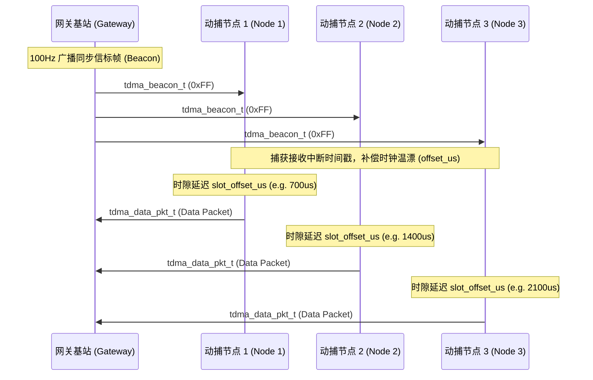

# SomatoSync 系统网络与通信协议规范

本文档定义了整个 SomatoSync 动作捕捉系统的网络架构、时分多址（TDMA）时隙调度、近场带外（OOB）配网机制，以及射频链路传输协议（C 语言一字节对齐结构体定义）。

---

## 1. 物理层与数据链路层规范

### 1.1 射频介质与参数配置
* **物理层**：基于 ESP32-S3 内置的 2.4GHz 射频收发器，工作于 802.11 b/g/n 物理层基带，信道带宽 20MHz，支持 Wi-Fi Station 模式下 1 至 13 信道。
* **空口提速**：为了极限压缩单包空中飞行时长（Airtime），系统底层将 ESP-NOW 的物理层发送速率强制超频配置为 **`WIFI_PHY_RATE_24M` (24Mbps OFDM 调制)**。单包实际空口飞行时长压低至约 115µs ~ 120µs，极大提高了多节点共存环境下的信道空闲率。

### 1.2 数据链路层选择 (ESP-NOW)
* **无连接帧发射**：数据链路层废除传统 TCP/UDP/IP 协议栈，全面采用无连接的对等链路层协议 **ESP-NOW**，绕过 LwIP 复杂交互与连接握手，大幅降低通信延迟和硬件功耗。

---

## 2. 时分多址 (TDMA) 时隙调度与时钟对齐

为了解决多节点并发数据上报时的空口物理碰撞问题，系统强制引入了 **TDMA（Time Division Multiple Access）** 分时调度机制：

### 2.1 同步流程图


### 2.2 时钟对齐与温漂抑制
* **同步信标 (Beacon)**：网关以 **100Hz（每 10ms）** 周期向全网广播 `tdma_beacon_t` 同步信标帧。
* **二阶锁相校准**：信标帧中携带网关发出时的绝对时间戳 `global_time_us`。从节点接收到信标的中断瞬间，捕获本地高精度硬件定时器值，通过二阶线性回归算法计算出本地与网关的时间偏移量 `offset_us` 进行补偿，抑制本地石英晶振的温度漂移。

### 2.3 时隙分配与飞轮容错
* **时隙划分与自适应均分**：系统废弃了原有的硬编码 700µs 时隙间隔，引入了**运行时时隙自适应均分算法**。网关在开机时根据配置的目标节点数 \(N\)，自动计算出最大化的时隙步长（时隙阶梯间隔 = \(\lfloor 8000 / N \rfloor\) 微秒，且上限为 5000µs，下限为 700µs 保护带）。例如：
  - 当 $N = 4$ 时，时隙阶梯自动拉宽至 **2000µs**（节点发送时隙分别为：Node 1 = 2000µs，Node 2 = 4000µs，Node 3 = 6000µs，Node 4 = 8000µs）。
  - 当 $N = 12$ 时，时隙阶梯自动收窄为 **700µs**。
  均分算法在极少数节点在线的场景下（如全身运动障碍追踪的最小演示配置）可以拉大节点间的空口间距，提供极高的时间裕度与稳定性。
* **硬件单次定时器触发**：信标接收后，节点启动一个高精度的单次硬件定时器（Slot Timer），在延迟 `slot_offset_us` 后触发发送任务，利用约 400µs 的物理发射窗口快速发射，尾部保留硬隔离带（Guard Interval），彻底杜绝空口碰撞。
* **时钟飞轮守护 (Flywheel Dead-Reckoning)**：若空口突发干扰导致个别 Beacon 帧丢失，守护定时器溢出，节点自动进入飞轮模式，基于上次同步时估算出的频率漂移自激推算全局时标，维持 TDMA 时序不中断。
* **失步静默自保护 (Silent Error)**：若**连续 3 帧（30ms）丢失 Beacon**，系统判定链路失步，节点状态机紧急切入 `STATE_SILENT_ERROR`（静默故障态）并立即终止射频发射，防止漂移的本地时钟侵占相邻节点的空口信道。

---

## 3. 全栈通信协议定义

协议为了保证多编译平台（ESP32-S3 Xtensa GCC、PC x86 MSVC/Clang）之间直接进行指针强转解析而无字节空洞，所有结构体均强制使用 `#pragma pack(push, 1)` 进行 **1 字节严格对齐**。

```c
// ============================================================================
// 一、NFC OOB 物理层配网协议 (ST25DV Mailbox 专用)
// ============================================================================
#define TDMA_NFC_MAGIC 0xAA55 

#pragma pack(push, 1)
typedef struct {
    uint16_t magic_word;      // 魔法字，固定为 TDMA_NFC_MAGIC，防止射频噪声误触发
    uint8_t  cmd_type;        // 命令字：0x01 = 强制入网与时隙覆写, 0x02 = 仅唤醒
    uint8_t  node_id;         // 分配的物理拓扑节点 ID (1~15)
    uint8_t  gateway_mac[6];  // 网关的真实 Wi-Fi MAC 地址，用于 ESP-NOW 绑定
    uint8_t  node_unicast_lmk[16]; // 👈 节点专属单播密钥 (用于单播链路硬件加密)
    uint8_t  beacon_cmac_key[16];  // 👈 全局群组会话密钥 (用于广播 Beacon 应用层 CMAC 验签)
    uint32_t slot_offset_us;  // 分配的 TDMA 周期内微秒级发送延迟
    uint32_t target_fw_ver;   // 目标固件版本号，用于版本对比自检
    uint32_t crc32;           // 前 50 字节的 CRC-32 循环冗余校验，防止磁场抖动变异
} tdma_nfc_payload_t; // 总计 54 字节
#pragma pack(pop)
```

```c
// ============================================================================
// 二、网关广播信标协议 (100Hz 同步发令枪)
// ============================================================================
#define TDMA_PKT_BEACON 0xFF

#pragma pack(push, 1)
typedef struct {
    uint8_t  type;               // 包类型，固定为 TDMA_PKT_BEACON (0xFF)
    uint32_t frame_seq;          // 全局调度帧自增序列号
    uint64_t global_time_us;     // 网关绝对系统微秒时间戳 (esp_timer_get_time)
    uint16_t active_nodes_bitmask; // 在线存活节点二进制位掩码
    uint8_t  sys_state;          // 网关系统状态机，对应 gateway_state_t 枚举
    uint8_t  next_channel;       // 自适应跳频（AFH）目标信道 (0 = 无跳频)
    uint8_t  switch_countdown;   // 跳频倒计时帧数 (从 10 递减至 1)
    uint32_t cmac_tag;           // 使用 beacon_cmac_key 计算的前 18 字节 CMAC 签名值
} tdma_beacon_t; // 总计 22 字节
#pragma pack(pop)
```

```c
// ============================================================================
// 三、节点数据上报协议 (数据链路层载荷)
// ============================================================================
#define TDMA_PKT_DATA 0x01

#pragma pack(push, 1)
// 节点单帧压缩载荷 (Internal Frame)
typedef struct {
    int16_t accel[3];        // 三轴线加速度，直接透传 MPU/ICM 原始 16 位 ADC 源码
    int16_t gyro[3];         // 三轴角速度，直接透传 MPU/ICM 原始 16 位 ADC 源码
    int16_t quat[4];         // 姿态四元数，由 Float 乘以 32767 量化为定点 Q15 格式
    uint16_t time_offset_us; // 相对于本数据包基准时间的原点微秒偏移量 (0~10000us)
} somato_imu_frame_t; // 单帧：22 字节 (Float 格式原码为 48 字节)

#define SOMATO_FRAMES_PER_PACKET 10

// 10 帧数据聚合载荷 (100Hz 对应 10 帧数据聚合)
typedef struct {
    somato_imu_frame_t frames[SOMATO_FRAMES_PER_PACKET];
} somato_slot_payload_t; // 聚合载荷：220 字节

// ESP-NOW 物理层实际空口发送的完整结构
typedef struct {
    uint8_t  type;           // 包类型，固定为 TDMA_PKT_DATA (0x01)
    uint8_t  node_id;        // 节点物理拓扑 ID
    uint8_t  battery_pct;    // 节点剩余电量百分比 (0-100)
    uint32_t packet_seq;     // 节点上报的自增数据包序列号
    uint8_t  payload_len;    // 载荷长度 (220)
    uint8_t  payload[220];   // 220 字节用户载荷 (somato_slot_payload_t)
} tdma_data_pkt_t; // 空口包总大小：228 字节 (严格处于 ESP-NOW 250B MTU 红线内)
#pragma pack(pop)
```

---

## 4. 网关数据有线回传与 COBS 编码

网关基站接收到多节点并发的数据包后，在内存中进行时间基准重建，并封装为以太网转发包，通过有线硬核以太网芯片 **W5500** 转发至上位机。

### 4.1 网关以太网转发包结构
网关在 `esp_now_recv_cb` 中断回调中，获取本地系统毫秒时间戳 `base_time_ms` 替换 `packet_seq` 的相对属性，组合为 **235 字节** 的转发帧：
```c
#pragma pack(push, 1)
typedef struct {
    uint8_t  type;           // 包类型：0x01 (Data)
    uint8_t  node_id;        // 节点物理拓扑 ID
    uint8_t  battery_pct;    // 节点剩余电量百分比 (0-100)
    uint32_t packet_seq;     // 节点上报的自增数据包序列号
    uint64_t base_time_us;   // 网关接收到此包时的本地绝对微秒时间戳
    somato_imu_frame_t frames[SOMATO_FRAMES_PER_PACKET]; // 220 字节 IMU 数据载荷
} mocap_optimized_pkt_t; // 应用层包总大小：235 字节
#pragma pack(pop)
```

### 4.2 W5500 硬件接口与引脚映射
网关通过高速 SPI2 主机总线挂载 **W5500**，用于高速稳定的以太网 UDP 数据透传：
* **引脚连接**：
  * `MOSI`: GPIO11，`MISO`: GPIO12，`SCK`: GPIO13
  * `CS`: GPIO14，`INT`: GPIO10，`RST`: GPIO9

### 4.3 COBS 编码分包与粘包防范
- 为了防止 UDP 及有线串口传输过程中的数据截断、粘包及随机断帧，系统在数据发送前引入了 **COBS (Consistent Overhead Byte Stuffing)** 编码。
- COBS 编码将有效载荷中的所有 `0x00` 字节转换为非零的链表偏移量，最终在数据帧尾部追加一个唯一的 `0x00` 字节作为物理帧界定符（Delimiter）。
- 上位机解码引擎只需要查找数据流中的 `0x00` 即可锁定一帧完整的数据包，实现极低开销下的数据自对齐。
