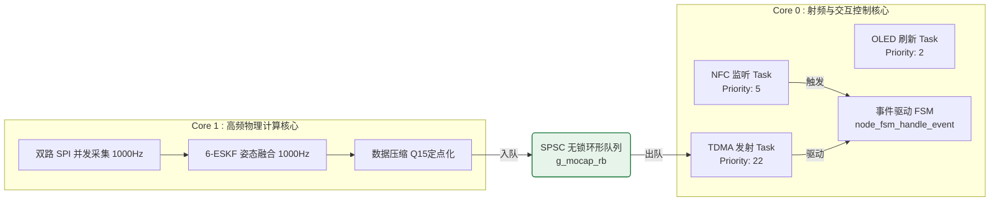

# SomatoSync 软件引擎与事件驱动状态机规范

本文档详述了 SomatoSync 动作捕捉系统的软件架构、对称多处理器（SMP）双核任务模型、无锁跨核队列设计，以及基于事件驱动状态转移表的网关与节点控制流设计。

---

## 1. 软件双核对称多处理器 (SMP) 隔离模型

为了满足 1000Hz 物理采样率下的高精度运动解算，并且保证无线网络射频发射不产生时序串扰，系统在 FreeRTOS 对称多处理（SMP）底座上执行严格的**不对称双核任务隔离机制**：



### 1.1 核心任务模型与优先级划分

| 任务名称 | 运行核心 | 任务优先级 | 栈空间大小 | 周期节拍 | 核心职责 |
| :--- | :--- | :--- | :--- | :--- | :--- |
| `imu_task` | Core 1 | 20 | 8 KB | 1 ms (1000Hz) | 独占物理核，并发双路 SPI 读取，执行 ESKF 解算、量化压缩并推入跨核缓冲。 |
| `net_send_task` | Core 0 | 22 | 4 KB | 10 ms (100Hz) | 接收网关信标（Beacon）同步信号，延迟专属时隙，从跨核缓冲中出队数据进行 ESP-NOW 发送。 |
| `nfc_monitor_task` | Core 0 | 5 | 16 KB | 事件驱动 | 阻塞在 GPO 硬件中断上，读取 ST25DV 邮箱并触发配网事件。 |
| `oled_task` | 任意核 | 2 | 4 KB | 100 ms (10Hz) | OLED 画面刷新与交互，低优先级。 |
| `app_main` | Core 0 | 默认 | 8 KB | 50 ms | 系统初始化自检，执行系统健康监控与调试日志输出。 |

> [!IMPORTANT]
> **任务优先级约束**
> 1. `net_send_task`（22）及 `imu_task`（20）拥有极高优先级。采集与发送在物理核心和调度优先级上完全隔开，消除网络协议栈阻塞对传感器读取带来的抖动。
> 2. `nfc_monitor_task` 采用 `ulTaskNotifyTake` 阻塞死等机制，零消耗 CPU，仅在物理“碰一碰”触发硬件中断时瞬间唤醒。

---

## 2. 跨核单写单读无锁环形队列 (SPSC RingBuffer)

为了避免跨核数据交换时互斥锁（Mutex）带来的优先级反转和 CPU 自旋忙等，系统在 Core 1 与 Core 0 之间架设了 **SPSC（Single-Producer Single-Consumer）无锁环形队列**：

### 2.1 零锁机制与内存屏障
- **并发安全性**：由于生产者（`imu_task`）仅修改写指针 `write_idx`，消费者（`net_send_task`）仅修改读指针 `read_idx`，读写指针之间天然解耦。
- **内存可见性**：使用 `__ATOMIC_ACQUIRE` 和 `__ATOMIC_RELEASE` 原语建立跨核内存屏障，保证 Core 0 与 Core 1 的 PSRAM/SRAM 缓存一致性。

### 2.2 队列溢出与背压策略
- **队列容量**：静态配置为 64 帧载荷深度。
- **溢出裁切 (`ESP_TDMA_QUEUE_DISCARD_STALE`)**：当无线信道遭遇强干扰产生丢包（导致消费者滞后）时，队列一旦满载，生产者自动执行“头部裁切”，强制抛弃最旧的历史帧，腾出空间写入最新数据。这在数学上保证了数据流的实时性，使端到端的传输排队延迟永远趋近于 0 ms。

---

## 3. 网关事件驱动状态转移表 (Gateway FSM)

网关状态机全面废除传统的轮询式 switch-case 架构，重构为**事件驱动状态转移表**，实现了状态跳转逻辑与业务控制的解耦。

### 3.1 状态与事件定义
```c
typedef enum {
    GW_STATE_IDLE,              // 空闲：系统刚启动或重启复位
    GW_STATE_REGISTERING,       // 配网态：NFC 启动，等待节点碰一碰上线打卡
    GW_STATE_OTA_PREPARING,     // OTA 准备态：民主裁决达成，下发指令，静默等待信道
    GW_STATE_OTA_TRANSFER,      // OTA 传输态：固件切片发送中
    GW_STATE_RUNNING,           // 运行态：全员在线就绪，下发 Beacon 维持 TDMA 并收集数据
} gateway_state_t;

typedef enum {
    GW_EV_START_REGISTRATION,   // 启动配网集结
    GW_EV_NODE_REPORTED,        // 收到节点上报的 REG_ACK 握手包
    GW_EV_TRANSFER_COMPLETE,    // OTA 传输完全结束
    GW_EV_RESET_SYSTEM,         // 强制重置网关状态机
} gateway_event_t;
```

### 3.2 转移矩阵定义与查表引擎
转移表内声明了状态跳转的条件约束（`guard`，卫语句）和跳转后的动作（`action`，动作执行器）：

```c
typedef struct {
    gateway_state_t cur_state;
    gateway_event_t event;
    bool (*guard)(const gateway_event_data_t *data);
    void (*action)(const gateway_event_data_t *data);
    gateway_state_t next_state;
} gateway_transition_t;

// 网关核心状态转移表
static const gateway_transition_t g_gateway_table[] = {
    { GW_STATE_IDLE,         GW_EV_START_REGISTRATION, NULL,                 NULL,                    GW_STATE_REGISTERING },
    { GW_STATE_REGISTERING,  GW_EV_NODE_REPORTED,      guard_reg_not_full,   action_record_node,      GW_STATE_REGISTERING },
    { GW_STATE_REGISTERING,  GW_EV_NODE_REPORTED,      guard_threshold_upgrade, action_trigger_ota,   GW_STATE_OTA_PREPARING },
    { GW_STATE_REGISTERING,  GW_EV_NODE_REPORTED,      guard_threshold_run,  action_start_running,    GW_STATE_RUNNING },
    { GW_STATE_OTA_PREPARING,GW_EV_TRANSFER_COMPLETE,  NULL,                 NULL,                    GW_STATE_OTA_TRANSFER },
    { GW_STATE_OTA_TRANSFER, GW_EV_TRANSFER_COMPLETE,  NULL,                 NULL,                    GW_STATE_REGISTERING },
    { GW_STATE_RUNNING,      GW_EV_RESET_SYSTEM,       NULL,                 NULL,                    GW_STATE_IDLE },
};
```

> **分级降级策略（运行态掉线）**：`GW_STATE_RUNNING` 下节点掉线由独立看门狗任务（`gateway_timeout_task`）巡检处理，不依赖事件转移表：活跃节点数 **≥ target 时保持 RUNNING**，仅等待新节点经 NFC 补充注册；**0 < 活跃数 < target 时退回 REGISTERING**（保留在线节点加速聚集）；活跃数为 0 才退回 IDLE。目标节点数 `target` 可在运行时经 `gateway_fsm_set_target_node_count()` 实时修改（OLED 菜单 / NVS 持久化），TDMA 时隙随之按 8000/N 重算。

---

## 4. 节点端事件驱动状态转移表 (Node FSM)

节点的状态自适应跳转与空中网关状态深度锁定，状态转换通过触觉马达驱动进行物理反馈。

### 4.1 状态与事件定义
```c
typedef enum {
    STATE_POWER_ON_NFC_CHECK,   // 上电默认态：等待 NFC 碰一碰配置参数
    STATE_WIFI_FOTA_UPGRADING,  // Wi-Fi FOTA 升级态：NFC 邮箱标记了 Wi-Fi FOTA 模式时进入
    STATE_TDMA_LOCKING,         // 同步锁定态：开启无线，搜寻网关 Beacon
    STATE_MOCAP_RUNNING,        // 动捕运行态：同步锁成功，进入 TDMA 发射业务流
    STATE_MOCAP_OTA,            // 升级态：触发全网无线 OTA 升级
    STATE_SILENT_ERROR,         // 静默故障态：Beacon 连续丢失失步，射频自动闭锁
} mocap_node_state_t;

// 节点 FSM 仅通过两个事件驱动（底层 TDMA 状态变化 + NFC 触发），
// 而非为每个状态转移定义独立事件。TDMA 状态与节点状态的对应关系
// 由 node_fsm.c 中的守卫函数（guard）判断。
typedef enum {
    NODE_EV_NFC_TRIGGERED,       // NFC 配网中断触发且数据校验通过
    NODE_EV_TDMA_STATE_CHANGED,  // 底层 TDMA 状态变化事件（携带新 TDMA 状态）
} node_event_t;
```

### 4.2 节点状态转移矩阵与物理反馈
```c
static const node_transition_t g_node_transition_table[] = {
    // 当前状态                    | 事件                      | 守卫条件                   | 动作                | 下一个状态
    {STATE_POWER_ON_NFC_CHECK,     NODE_EV_NFC_TRIGGERED,      NULL,                       action_handle_nfc,       STATE_TDMA_LOCKING},
    {STATE_POWER_ON_NFC_CHECK,     NODE_EV_TDMA_STATE_CHANGED, guard_tdma_registering,     action_enter_locking,    STATE_TDMA_LOCKING},

    {STATE_TDMA_LOCKING,           NODE_EV_TDMA_STATE_CHANGED, guard_tdma_running,         action_enter_running,    STATE_MOCAP_RUNNING},
    {STATE_TDMA_LOCKING,           NODE_EV_TDMA_STATE_CHANGED, guard_tdma_ota,            action_enter_ota,        STATE_MOCAP_OTA},
    {STATE_TDMA_LOCKING,           NODE_EV_TDMA_STATE_CHANGED, guard_tdma_silent_error,   action_enter_silent_error,STATE_SILENT_ERROR},
    {STATE_TDMA_LOCKING,           NODE_EV_TDMA_STATE_CHANGED, guard_tdma_idle,           action_enter_idle,       STATE_POWER_ON_NFC_CHECK},

    {STATE_MOCAP_RUNNING,          NODE_EV_TDMA_STATE_CHANGED, guard_tdma_registering,     action_enter_locking,    STATE_TDMA_LOCKING},
    {STATE_MOCAP_RUNNING,          NODE_EV_TDMA_STATE_CHANGED, guard_tdma_ota,            action_enter_ota,        STATE_MOCAP_OTA},
    {STATE_MOCAP_RUNNING,          NODE_EV_TDMA_STATE_CHANGED, guard_tdma_silent_error,   action_enter_silent_error,STATE_SILENT_ERROR},

    {STATE_SILENT_ERROR,           NODE_EV_TDMA_STATE_CHANGED, guard_tdma_registering,     action_enter_locking,    STATE_TDMA_LOCKING},

    {STATE_MOCAP_OTA,              NODE_EV_TDMA_STATE_CHANGED, guard_tdma_idle,           action_enter_idle,       STATE_POWER_ON_NFC_CHECK},
};
```

### 4.3 状态转移物理震动反馈机制
各状态转换触发时，节点调用马达驱动发出清晰的触觉震动反馈，利于临床医生快速诊断设备状态（震动反馈由 `drv2605_play_waveform()` 触发，具体波形 ID 在 `node_fsm.c` 的各 action 函数中配置）：
- **→ `STATE_TDMA_LOCKING`**：起振 **Sharp Click**（锐利双击），代表卡片碰一碰配置写入完毕，开始捕获射频。
- **→ `STATE_MOCAP_RUNNING`**：起振 **Strong Click**（强力震感），代表节点已锁定网关时隙，动捕采集解算开始发射。
- **→ `STATE_MOCAP_OTA`**：起振 **Triple Click**（连续三连击），提示节点进入无线固件升级模式。
- **→ `STATE_SILENT_ERROR`**：起振 **Buzz**（低频持续蜂鸣），警告设备失步，已强制静默，需检查基站距离或频段物理干扰。

---

## 5. 节点初始化启动流程

节点上电后按照时序关系进行设备级初始化：

```
                              系统上电自举
                                   │
                                   ├── NVS Flash 域初始化 (读取出厂信息)
                                   ├── GPIO 外部中断服务安装 (ESP_INTR_FLAG_IRAM)
                                   ├── I2C 总线初始化 (hw_i2c_init)
                                   ├── ST25DV04K NFC 邮箱读取与校验 (CRC-32)
                                   │       └── 若校验通过 -> is_nfc_boot = true
                                   ├── 注册 NFC GPO 中断回调任务
                                   ├── 开启 LDO1 与 LDO2 使能引脚 -> 延时 50ms 待电压稳定
                                   ├── 启动 LEDC PWM 时钟树 (32.768kHz -> GPIO11)
                                   ├── I2C OLED 屏幕初始化
                                   ├── DRV2605 触觉驱动初始化并执行自动谐振自检
                                   ├── 初始化电池电量检测 (ADC 或 MAX17048G)
                                   ├── 初始化双路高速独立 SPI 总线 (SPI2=IMU-A, SPI3=IMU-B)
                                   ├── 双路 IMU 并发中断线配置并创建 EventGroup
                                   ├── 双路 IMU 底层参数写入与空间残差校准矩阵加载
                                   ├── 姿态估计 6-ESKF 状态与初值初始化
                                   │
                                   ├── 创建计算任务 imu_task (Core 1, Priority 20)
                                   ├── 创建显示任务 oled_task (Core 0/1, Priority 2)
                                   └── 执行 node_fsm_init()
                                           └── 若 is_nfc_boot -> 发送 NODE_EV_NFC_TRIGGERED 事件
                                           └── 进入 while(1) { 执行 50ms 周期系统健康和稳态日志监控 }
```
